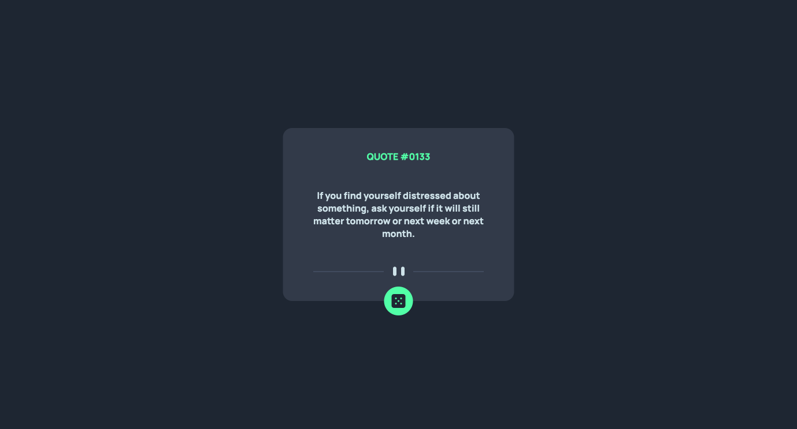

# Frontend Mentor - Advice generator app solution

This is a solution to the [Advice generator app challenge on Frontend Mentor](https://www.frontendmentor.io/challenges/advice-generator-app-QdUG-13db). Frontend Mentor challenges help you improve your coding skills by building realistic projects.

## Table of contents

- [Overview](#overview)
  - [The challenge](#the-challenge)
  - [Screenshot](#screenshot)
  - [Links](#links)
- [My process](#my-process)
  - [Built with](#built-with)
  - [What I learned](#what-i-learned)
  - [Continued development](#continued-development)
  - [Useful resources](#useful-resources)
- [Katherine Adjahoe](#author)

## Overview

### The challenge

Users should be able to:

- View the optimal layout for the app depending on their device's screen size
- See hover states for dice
- Generate a new piece of advice by clicking the dice icon

### Screenshot

### Links

- Solution URL: [https://github.com/KLPython2020/advice-generator]
- Live Site URL: [https://advice-generator-sage.vercel.app/](https://advice-generator-sage.vercel.app/)

## My process

### Built with

- Semantic HTML5 markup
- CSS Grid
- Mobile-first workflow
- Vanilla Javascript
- [Open-props](https://open-props.style/) - For some styles

### What I learned

One of the things I tackled while coding this project is managing click events. I did a deep dive into the difference between debouncing and throttling.
I ended up using the throttling technique to manage how often will the click event fire.

I also found a quick reference for styling the animation of the button from [Open-props.style](https://open-props.style/) created by [Adam Argyle](https://github.com/argyleink).

### Continued development

There is room for improvement with both my css and javascript, but the goal now is to create this in react.

### Useful resources

- [Throttling vs Debouncing](https://gomakethings.com/debouncing-vs.-throttling-with-vanilla-js/) - This helped me manage the click event of the dice, so there are fewer calls to the api and displaying the data is smoother.
- [Open-props.style](https://open-props.style/) - This was a fast way to do some animation and style the container holding everything for the advice generator.

## Author

- Website - [Katherine Adjahoe](http://katherineadjahoe.com/home)
- Frontend Mentor - [@KLPython2020](https://www.frontendmentor.io/profile/KLPython2020)
- Twitter - [@KatherineTheWeb](https://twitter.com/KatherineTheWeb/)

